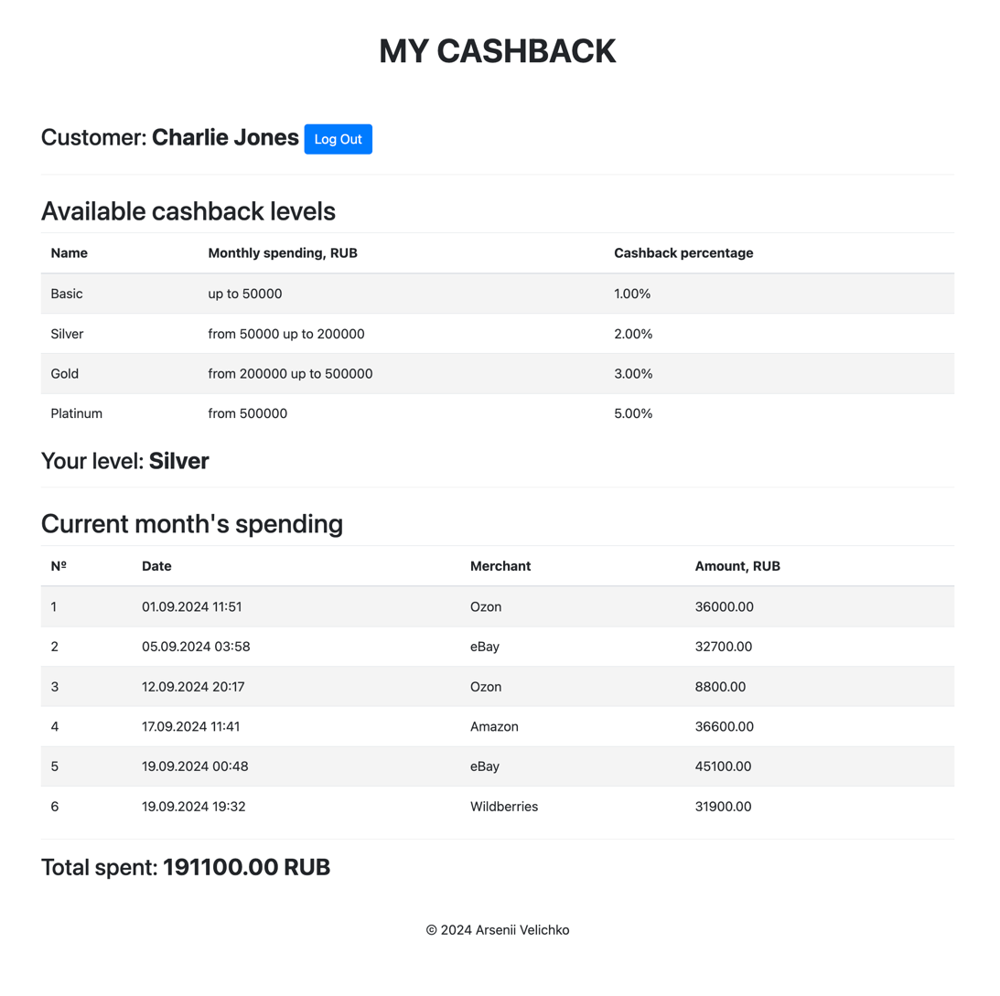
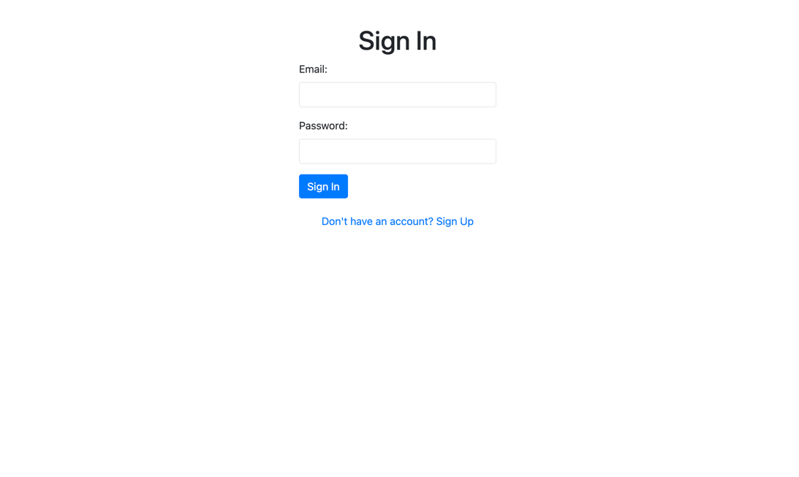
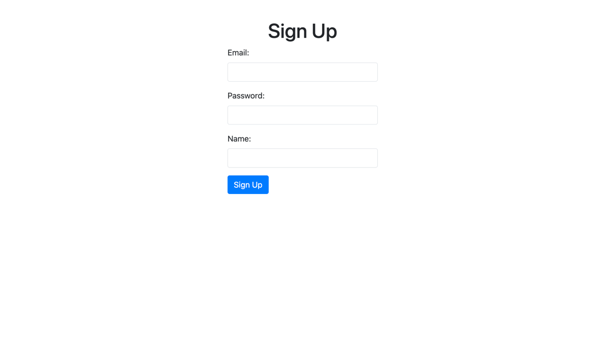

# Cashback portal

Арсений Величко, 2024

## Описание

Личный кабинет клиента программы лояльности. Позволяет получать информацию о доступных уровнях кешбека и текущем уровне
кешбека клиента на основании его трат в текущем месяце. Позволяет регистрировать пользователей и авторизовывать их.
Данные клиентов доступны им только после авторизации.

## Скриншоты

## Технологии

- Python 3.12
- FastAPI
- SQLAlchemy
- SQLite
- MVC Pattern
- JWT + Cookies
- Jinja2
- Bootstrap
- Docker
- Docker-compose

## Запуск и использование

Для запуска приложения необходимо установить Docker и Docker-compose. После этого необходимо склонировать
репозиторий и, в корне репозитория, выполнить команду `docker-compose up --build`. После этого приложение будет
доступно по адресу `http://localhost:8000/`.

При старте создаются пять тестовых пользователей со случайными именами и тестовым набором покупок. Тестовые пользователи
имеют почты test1@example.com, test2@example.com, ..., test5@example.com. Пароль у всех тестовых пользователей
`foobar42`. С помощью страниц входа и регистрации можно войти под одним из тестовых пользователей или зарегистрировать
нового. БД хранится в оперативной памяти и удаляется при остановке контейнера. После перезапуска тестовые пользователи
генерируются заново.